# 面向Chlamydomonosia小组的《我的世界》mod开发教程

## 目录


## 绪论：什么是《我的世界》mod

众所周知，Minecraft是一个官方支持盗版的游戏。那么，究竟是什么维持了MC的经久不衰呢？我个人认为，丰富的mod系统正是维持MC活力的第一要素。既然你已经来到了这个教程，你大概已经知道一个mod的样子了。接下来，我们先介绍mod的发展史。  

很久很久以前，一群玩家对MC的内容产生了不满。那时，MC官方支持盗版的行为还没有出现。这群玩家毅然决定：反编译MC，修改其代码，做出自己想要的游戏！  

当然，mojang对MC的代码进行了混淆。玩家们反编译出代码时，只会看到以下天书：  

```java
class a{
    public a(b c, d e, int f ){
        this.g = h.i(c, e);
        this.j = k.l.m(f);
    }
}
```

但是，这并没有阻止最早的mod开发者。他们通过大胆猜想，严谨证明，找到了各个变量的含义。于是，最早的mod诞生了。  

接下来的一段时间里，mod的开发仍然需要开发者看懂这些天书般的代码。直到一些玩家自发地创造了一套通用的反混淆名称，并向所有mod开发者开放。这就是现在mod开发的基础——Minecraft Coder Pack (MCP)。MCP的出现，使mod开发难度骤降，大量优秀的mod涌现。建筑mod (Buildcraft)就是其中的典范。MCP本身是违法的，但mojang意识到，mod一定会大大增加MC的热度。因此，mojang一直默许MCP的存在。

然而，依靠MCP编写的mod依然存在一些问题。如果你曾安装过一些古老的mod，你会发现它们的安装步骤是这样的：

* 解压mod文件，得到大量.class文件
* 将这些.class文件压缩到.minecraft\mods\minecraft.jar中

安装困难并不是MCP的最大问题。对玩家而言，最显著的问题是：各开发者的mod并不互相兼容，导致玩家几乎不可能安装两个以上的mod。

对开发者而言，各类问题也阻挡着他们的脚步：

* MC很多地方的代码都是垃圾代码，不同开发者为实现自己的功能做出了不同的修改，导致mod之间深刻的不兼容性
* MC并没有一个完整的事件系统，各开发者需自己造轮子，更改MC核心代码

因此，为解决以上问题，我们现在使用的mod API——forge诞生了。

forge通过更改MC核心代码，创造了一套mod加载系统。这样，不同开发者的mod不会在加载阶段就显示出不兼容性。同时，forge加入了一些非常有用的扩展库，如事件系统，通用流体系统等，让各mod之间兼容性大幅提升。最后，forge允许各mod向其他开发者开放自己的API，实现真正的mod间联动。

现在，我将开始介绍mod的开发。

##　第一节：安装开发环境

Minecraft使用Java语言编写，因此，开发mod需要的最基础的工具，就是Java开发工具。你将需要：

* Java Development Kit 8 (jdk8)
* 一个Java IDE (对于Chlamydomonosia小组成员，应统一使用Intellij idea)

安装jdk后，你应[配置好环境变量](https://www.cnblogs.com/cnwutianhao/p/5487758.html)。

idea似乎有了[官方中文版](https://www.cnblogs.com/vipstone/p/12683829.html)。

接下来，我们要安装绪论中所述的forge API：

* 访问[Forge官网](https://files.minecraftforge.net/)

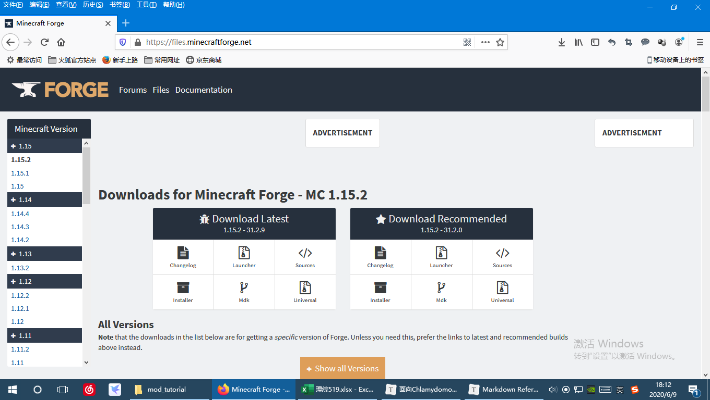

* 点击侧栏中的1.12.2

  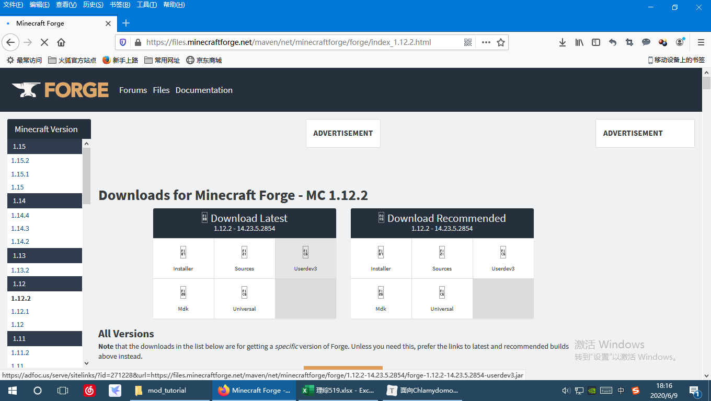

* 等待所有图标加载完成

  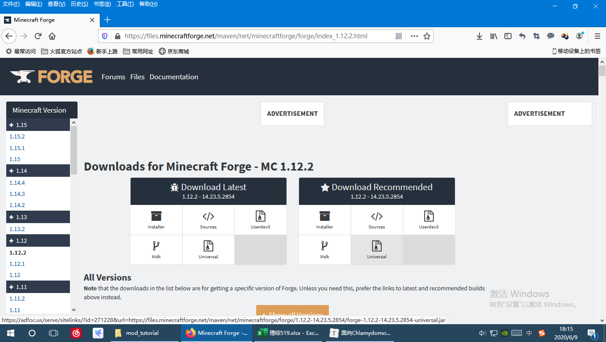

* 翻到下面的列表，点击14.23.5.2854行中的Mdk旁边的圆形按钮——**不要直接点击Mdk文字，否则会进入adfoc.us，而该网站已被墙**

  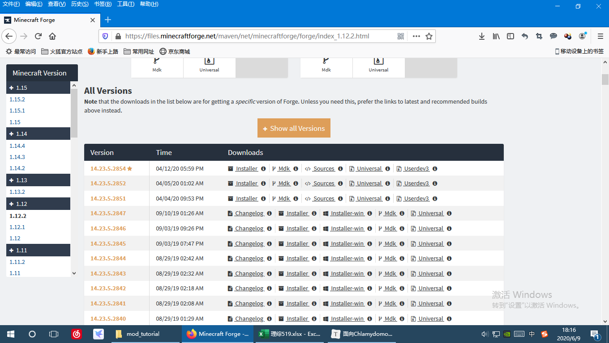

* 下载Mdk的zip文件后，解压到一个单独的纯英文路径

* 原先，forge采用控制台命令的形式初始化开发环境。但现在，forge对开发环境的搭建做了简化。只需用idea把解压出的文件夹中的`build.gradle`**作为工程打开**，idea会自动下载所需的文件。由于这些文件位于外网，下载将会极其缓慢。可先让导入过程后台运行（点击右下角按钮），再点击IDE左下角`Build`按钮查看进度。安装完成后将会显示以下内容：

  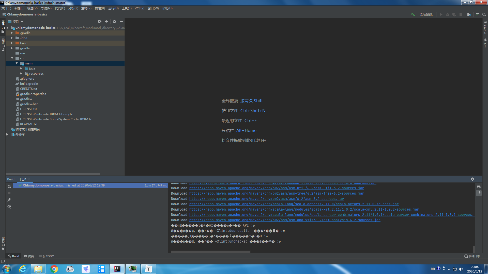
  
* 点击IDE右侧`Gradle`，运行`Tasks\fg_runs\genIntellijRuns`

  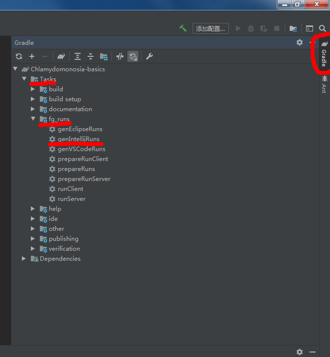

  这同样需要下载大量文件，主要为MC的材质包文件，极其缓慢。

* 点击IDE右上角运行按钮左侧的下拉菜单，选择`runClient`

  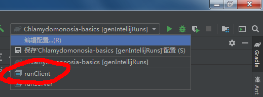

* 点击运行按钮，MC将会启动

  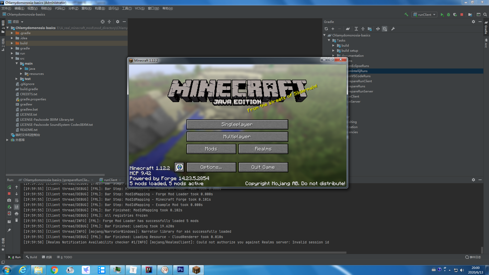

  这时，你应该需要更改MC的语言为简体中文。

* 安装[Git](https://gitforwindows.org/)(如果你不是Chlamydomonosia小组成员，忽略以下步骤)

* 选择IDE上方`文件-设置`，在设置窗口中选择`版本控制-Git`，IDE会自动识别安装的Git

  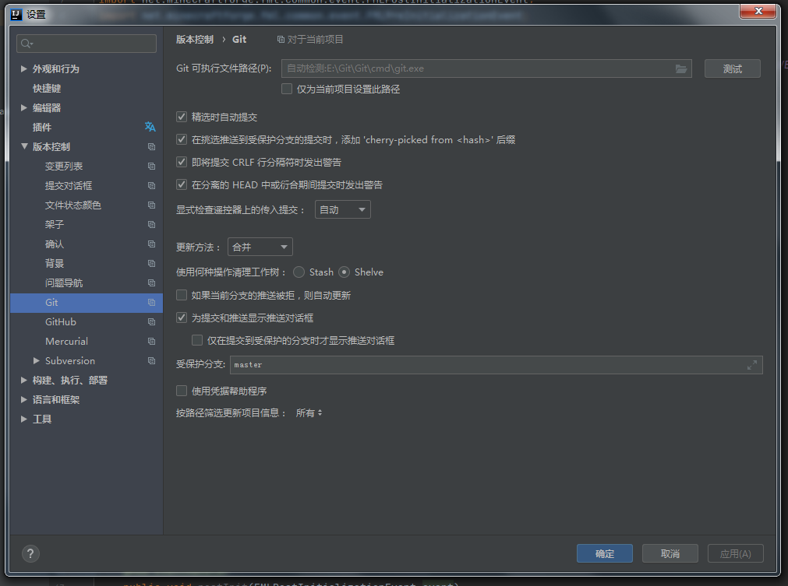

* 选择`Github`，登录你的Github账号(这时你应该联系我，让我把你加入合作者)

  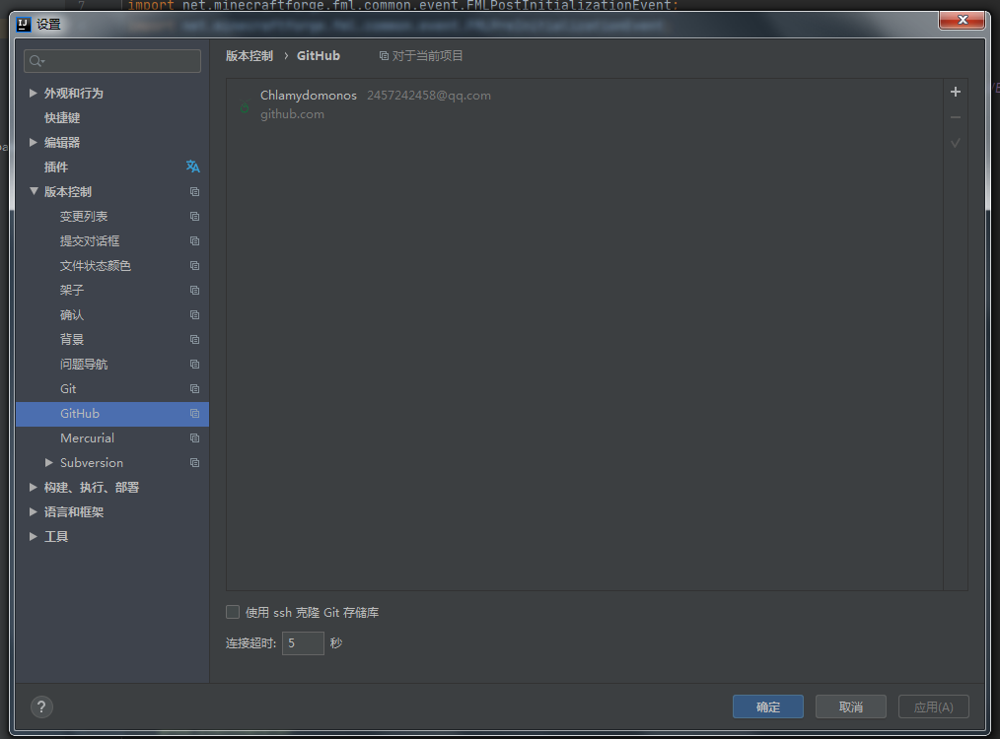

* 选择IDE上方`VCS-导入到版本控制-创建Git存储库`

  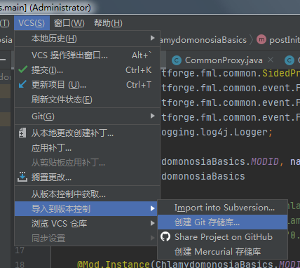

* 点击确定按钮即可

  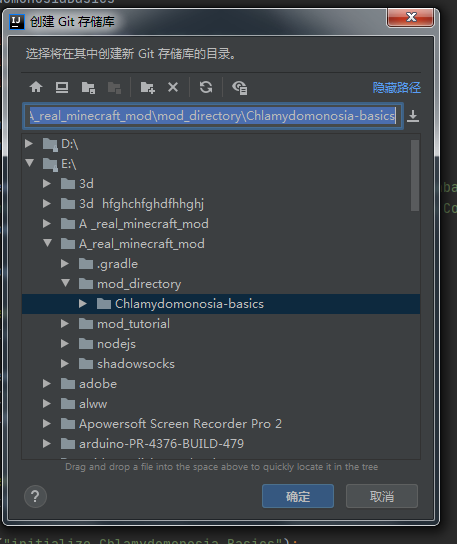

* 选择`VCS-Git-远程`

  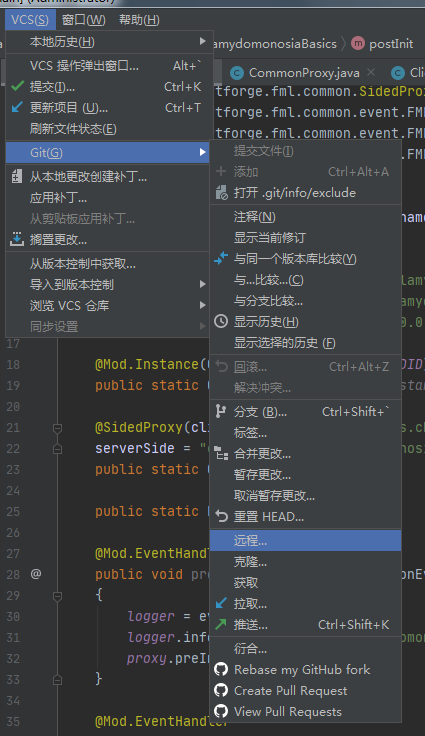

* 添加远程仓库，名称为origin，URL为https://github.com/Chlamydomonos/Chlamydomonosia-basics.git

  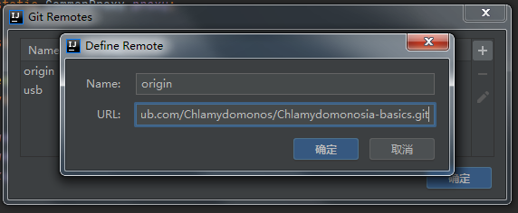

* 点击右上角蓝色箭头更新工程(之后你每次启动都应该这么做)，开发环境搭建完毕

  

注意，开发环境搭建过程中自动下载的文件默认保存在C盘的用户文件夹中，如果想更改路径，可以增加[环境变量](https://baijiahao.baidu.com/s?id=1652502091402613426&wfr=spider&for=pc)`GRADLE_USER_HOME`，值为你想更改的路径。

## 第二节：mod的基本结构

### (一) mod工程结构

本部分将仅介绍mod工程中部分文件夹及文件的功能。